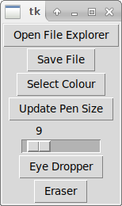
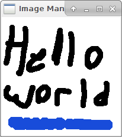

# Image Manipulation Tool

Mitchell Gale\
mgale@sfu.ca\
301349722

## How to Run
```
vagrant up
vagrant ssh -- -Y

cd project
./buildAll.sh
./runAll.sh
```
Run *./runAll.sh* to run the program.


*buildAll.sh* is used to build and make all the programs (Only required first time)\
*runAll.sh* is used to run the program, make sure *buildAll.sh* was run before you attempt to run the program.

After hitting "Open File Explorer" button, it will put you in a directory with some sample bitmap images. Select one of them to see it loaded in canvas. Some of the larger images take longer to load, so be patient (EveningSky.bmp). I recommend only loading *helloWorld.bmp*, not sure why the others take so long to load with vagrant/ssh.
Any saved images will be called output.bmp, but note if you wish to save them perminatly you should rename them, or else they will be overwrittenm. 

## Steps to use
Run *./runAll.sh* and ti will display 2 windows, one titled "tk" and the other titled "Image Manipulation Tool". The one titled "tk" is the toolbar, it contains buttons which can open the file explorer to select a bitmap image. It can save images and whatever was drawn on them to *output.bmp*. It allows you to change colours with the "select colour" button. The slider is used to change the size of the pen drawing, you need to click "Update Pen Size" button to send the new size to the canvas. Eraser works as expected, it used the current pen size and draws white where the pen is dragged, however it does reset the pen colour to white, so if you wish to draw again afterwards you need to change the colour.\

It may take a few clicks on the canvas to begin drawing because you need to get the window focus.

## Goal
<pre>
Build a program similar to a basic photoshop, gimp, paint.net or paint tool. Can draw on a canvas of loaded images, change
pen sizes and other basic programs. Canvas then can be saved as a bitmap, or bitmap can be loaded in and drawn on.

</pre>

## Features
<pre>
Loads bitmap images onto canvas (SDL) and lets the user draw on them.
User can load bitmap images by clicking the "Open File Explorer" button in the toolbar, which will open a window exploerer
User can Save the updated bitmap by clicking the "Save File" button in the toolbar, which will save the file in output.bmp
User can change pen size, pen colour, switch to "erasing" mode
Canvas automatically re-sizes
</pre>


## Languages
<pre>
Python3  | tkinter to handle toolbar (change pen colour, eraser, size of pen
C        | SDL for the canvas which can be drawn on 
Golang   | Bitmap File Reading and CMP(Custom Format) File writing. CMP file Reading and BMP file Writing
Bash     | Shell script to run C and Python3 programs 
Makefile | compiling the C program
</pre>

## Communication Methods
<pre>
ZeroMQ           | Handles communication between C and Python (2-way) - Sends information about toolbar changes
Files            | Handles file transfer between C and Golang (2-way) - Sends CMP file from Golang to C to be displayed on screen, sends CMP from C to Golang
Executable Calls | Handles telling Golang files when to run and handle files given to it (1-way)
</pre>

## Sample Images



